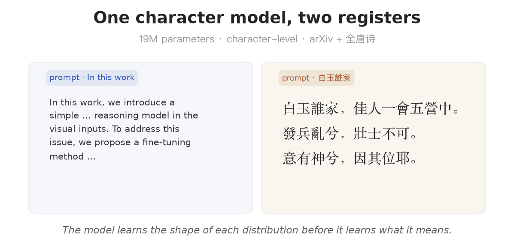
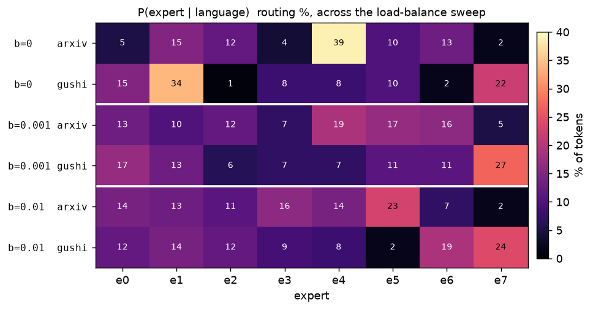

# llm — rebuilding a modern decoder, one mechanism at a time

`llm/` rebuilds the mechanisms behind a modern decoder-only LLM (Llama / Qwen lineage) from their
source papers — not to compete with them, but to make each design choice **executable**: isolate the
mechanism, prove its signature property in one runnable file, assemble the parts into a trainable
mini-Llama, then use sparse routing as the capstone experiment.

Assembled and trained on a laptop GPU, it wrote this:

<p align="center">
  
</p>

It runs at **character level** — one token per character, ~8,300 of them, no word vocabulary — which
makes the feat precise: the model captures each distribution's *register* (ML-abstract cadence;
five/seven-character rhythm, even the 楚辞 particle **兮**) without its meaning. Below: how it's
built, and what it reveals about how it spends its compute.

## Architecture — from the 2017 block to a modern decoder

```
x = x + MHA(LayerNorm(x))      # 2017: full attention + absolute PE
x = x + FFN(LayerNorm(x))      #       FFN = Linear → GELU → Linear
```

| component | replaces | core mechanism |
|---|---|---|
| [rope](rope) | absolute PE | rotate Q/K → the dot product sees only the *relative* offset, every layer |
| [rmsnorm](rmsnorm) | LayerNorm | drop centering and bias; RMS scaling alone suffices |
| [swiglu](swiglu) | FFN | two matrices → three with a gate; hidden ×⅔ to hold the parameter count |
| [gqa](gqa) | multi-head attn | fewer KV heads than Q heads — for *inference* cache memory, not training FLOPs |
| [bpe](bpe) | tokenizer | merge frequent byte-pairs, not words/chars → why a token carries its leading space |
| [nano](nano) | (assembly) | the four, wired: pre-norm stream, RoPE inside attention, tied head, next-token loss |
| [kvcache](kvcache) · *in progress* | (inference) | decoding caches past K/V → each step O(L), not O(L²) |
| mla · *in progress* | attention | cache a low-rank latent, not K/V; RoPE forces a decoupled subspace |
| localattn · *in progress* | attention mask | each layer sees the last W tokens; depth restores reach; sinks stay |
| specdec · *in progress* | (inference) | draft small, verify big in one forward; rejection sampling keeps the output distribution exact |

Each folder is one standalone file whose output proves the mechanism. Assembled, `nano` trains
end-to-end (loss 3.28 → 0.05) and greedy-decodes a description of its own architecture.

## Tokenization — the same allocation problem, before training

The capstone stays character-level on purpose: one character, one token, so the MoE experiment
isolates *routing*, not tokenizer effects. The byte-level [`bpe`](bpe) is tested separately on the
same two corpora, and it surfaces the same tension a layer earlier. It round-trips both exactly
(byte-level BPE is lossless), but under one **shared merge budget** the scripts don't benefit
equally: at vocab 2048, English reaches **3.26 chars/token** while Chinese stays **below 1.0 (0.86)**
— Chinese still averages more than one token per hanzi, and many rarer hanzi types remain split
across byte-fragment tokens; a fifth of the learned vocabulary is partial-character fragments. Dedicating the budget to Chinese roughly **doubles** hanzi-as-token
coverage, at English's expense. Frequency-based allocation favors the cheaper distribution — the
MoE's balance↔specialization, before training even starts.

## Capstone — but what is the MoE actually for?

The striking generation above is **not** the Mixture-of-Experts' doing — and proving that is the
point. We swap `nano`'s SwiGLU for a Switch-MoE (8 experts/layer, **top-1** routing) and keep the
dense `nano` as the control: same per-token compute, 4× the capacity.

```
model        params   ce     arxiv max/live   gushi max/live   aux
dense        4.87M    2.61    —                —               —
MoE β=0      19.5M    2.62    39% / 6-of-8     34% / 6-of-8    7.5
MoE β=0.001  19.5M    2.57    19% / 8-of-8     27% / 8-of-8    4.6
MoE β=0.01   19.5M    2.84    23% / 7-of-8     24% / 7-of-8    4.0
```

The control makes the loss story clear: **the 4× total capacity does not translate into a
clear loss improvement** (2.57 vs 2.61, single-seed), and the dense model generates both scripts just
as fluently. So the dual samples above are *character modeling*, not routing. The MoE's **one exclusive result** is *how it allocates* — and that is the
interesting one. β (the load-balance weight in `loss = CE + β·aux`) exposes two coupled effects:

- **Collapse is the default.** At β=0 only 6/8 experts stay alive — one takes 39% of tokens. The aux
  loss revives them, and a *little* (β=0.001) does it at the **lowest** CE of all —
  consistent with recovering otherwise-unused capacity; too much (β=0.01) over-regularizes and the task pays.
- **Balance trades against specialization.** Left alone, the router carves the sharpest language
  split; raising β softens it — yet **e7 stays disproportionately tied to 古文 tokens at every β>0**
  (24–27% of poetry vs. 2–5% of English). The router finds the task boundary from the input alone;
  balancing only blunts
  how cleanly it may act on it.

<p align="center">
  
</p>

*Each language leans on different experts (e4 and e1 at β=0; e7 stays disproportionately tied to 古文
across the sweep); raising β spreads the load and softens the split — balance vs. specialization.*

A router is **input-conditioned, adaptive allocation of compute**, and β makes its governing tension
measurable: how evenly you force capacity to be used is in direct tension with how specialized it may
become. The MoE *separates* the two scripts — it does not fuse them; whatever cross-lingual sharing
exists lives in the embedding/attention/head, not the experts. Chinese is the harder side here: its
character vocabulary is much larger and more Zipfian. Numbers are single-seed, MPS-scale, naive routing.

## What this is — and isn't

A reconstruction for **understanding**, not a model card: no FlashAttention, production KV cache,
long context, or distributed training — by design. The standard it meets instead is that every mechanism it *does*
have was rebuilt from its paper with a test that proves the signature property, shared as one source
of truth across `nano` and the capstone, and reported with its limits stated — a negative result
(extra capacity ⇏ lower loss at this scale) honestly kept beside the positive one it isolates
(interpretable, input-conditioned routing). Reconstruction, not competition.

## Reproduce

```bash
uv venv && uv pip install torch matplotlib regex
python llm/nano/prepare.py                            # fetch the two corpora (~10 MB: arXiv + 全唐诗)
python llm/bpe/experiment.py                          # tokenizer allocation: shared BPE budget on the two corpora
python llm/nano/experiment.py --betas 0,0.001,0.01    # capstone: β sweep, routing table, heatmap, samples
python llm/nano/experiment.py --dense                 # the dense control
```

Every component also runs standalone (`python llm/rope/rope.py`, …). `nano.py` and `experiment.py`
**import** the hand-written components — one implementation, reused, not re-copied.
